# Rapport de projet — CSC8607 : Introduction au Deep Learning

> **Consignes générales**
> - Tenez-vous au **format** et à l’**ordre** des sections ci-dessous.
> - Intégrez des **captures d’écran TensorBoard** lisibles (loss, métriques, LR finder, comparaisons).
> - Les chemins et noms de fichiers **doivent** correspondre à la structure du dépôt modèle (ex. `runs/`, `artifacts/best.ckpt`, `configs/config.yaml`).
> - Répondez aux questions **numérotées** (D1–D11, M0–M9, etc.) directement dans les sections prévues.

---

## 0) Informations générales

- **Étudiant·e** : _Nom, Prénom_
- **Projet** : _Intitulé (dataset × modèle)_
- **Dépôt Git** : _URL publique_
- **Environnement** : `python == ...`, `torch == ...`, `cuda == ...`  
- **Commandes utilisées** :
  - Entraînement : `python -m src.train --config configs/config.yaml`
  - LR finder : `python -m src.lr_finder --config configs/config.yaml`
  - Grid search : `python -m src.grid_search --config configs/config.yaml`
  - Évaluation : `python -m src.evaluate --config configs/config.yaml --checkpoint artifacts/best.ckpt`

---

## 1) Données

### 1.1 Description du dataset
- **Source** (lien) : https://huggingface.co/datasets/timm/eurosat-rgb
- **Type d’entrée** (image / texte / audio / séries) : image
- **Tâche** (multiclasses, multi-label, régression) : multiclasses
- **Dimensions d’entrée attendues** (`meta["input_shape"]`) : (3, 64, 64)
- **Nombre de classes** (`meta["num_classes"]`) : 10

**D1.** Quel dataset utilisez-vous ? D’où provient-il et quel est son format (dimensions, type d’entrée) ?

Nous utilisons le dataset **EuroSAT RGB** (version RGB du dataset EuroSAT), disponible sur HuggingFace sous le nom `timm/eurosat-rgb`. Ce dataset provient d'images satellitaires Sentinel-2 et contient 27 000 échantillons géoréférencés et étiquetés représentant 10 classes d'occupation du sol. Le format des données est le suivant :
- **Type d'entrée** : Images RGB (3 canaux)
- **Dimensions** : 64×64 pixels par image
- **Format de stockage** : Images JPEG encodées en RGB (bandes visibles uniquement)
- **Source originale** : https://github.com/phelber/eurosat (Helber et al., 2019, IEEE Journal of Selected Topics in Applied Earth Observations and Remote Sensing)

### 1.2 Splits et statistiques

| Split | #Exemples | Particularités (déséquilibre, longueur moyenne, etc.) |
|------:|----------:|--------------------------------------------------------|
| Train | 16 200     | Split d'entraînement (~60% du dataset total)           |
| Val   | 5 400      | Split de validation (~20% du dataset total)            |
| Test  | 5 400      | Split de test (~20% du dataset total)                  |

**D2.** Donnez la taille de chaque split et le nombre de classes.  

Le dataset EuroSAT RGB contient **27 000 exemples** au total, répartis en trois splits :
- **Train** : 16 200 exemples (~60%)
- **Validation** : 5 400 exemples (~20%)
- **Test** : 5 400 exemples (~20%)

Le nombre de classes est **10** (classification multiclasses). Les métadonnées retournées par `get_dataloaders` sont :
```python
meta = {
    "num_classes": 10,
    "input_shape": (3, 64, 64)  # (canaux, hauteur, largeur)
}
```

**D3.** Si vous avez créé un split (ex. validation), expliquez **comment** (stratification, ratio, seed).

Aucun split n'a été créé manuellement. Le dataset `timm/eurosat-rgb` sur HuggingFace fournit déjà les trois splits (train, validation, test) pré-définis. Ces splits ont été établis selon les définitions du projet Google Research (référence : https://github.com/google-research/google-research/blob/master/remote_sensing_representations/README.md#dataset-splits). Nous utilisons directement ces splits sans modification, garantissant ainsi la reproductibilité et la comparabilité avec d'autres travaux utilisant le même dataset.

**D4.** Donnez la **distribution des classes** (graphique ou tableau) et commentez en 2–3 lignes l'impact potentiel sur l'entraînement.  

La distribution des classes a été calculée en exécutant `python -m src.explore_dataset --config configs/config.yaml`. Voici le tableau de distribution :

| Classe | Train | Validation | Test | Total |
|--------|-------|------------|------|-------|
| AnnualCrop | 1 791 | 613 | 596 | 3 000 |
| Forest | 1 787 | 605 | 608 | 3 000 |
| HerbaceousVegetation | 1 799 | 628 | 573 | 3 000 |
| Highway | 1 505 | 499 | 496 | 2 500 |
| Industrial | 1 492 | 507 | 501 | 2 500 |
| Pasture | 1 195 | 409 | 396 | 2 000 |
| PermanentCrop | 1 481 | 481 | 538 | 2 500 |
| Residential | 1 863 | 583 | 554 | 3 000 |
| River | 1 460 | 511 | 529 | 2 500 |
| SeaLake | 1 827 | 564 | 609 | 3 000 |
| **TOTAL** | **16 200** | **5 400** | **5 400** | **27 000** |

**Commentaire sur l'impact pour l'entraînement** : Le dataset est relativement équilibré avec un ratio max/min de 1.56 (classe la plus fréquente : 1 863 exemples en train, classe la moins fréquente : 1 195 exemples). Cette légère différence n'est pas suffisante pour nécessiter des poids de classes ou un échantillonnage stratifié. L'entraînement standard avec une fonction de perte CrossEntropyLoss devrait fonctionner correctement sans biais significatif vers les classes majoritaires.

**D5.** Mentionnez toute particularité détectée (tailles variées, longueurs variables, multi-labels, etc.).

Les particularités suivantes ont été détectées lors de l'exploration du dataset :

- ✓ **Toutes les images ont une taille uniforme** : 64×64 pixels (vérifié sur un échantillon de 100 images)
- ✓ **Images en RGB** : 3 canaux (mode RGB confirmé)
- ✓ **Pas de valeurs manquantes** : dataset complet avec 27 000 exemples étiquetés
- ✓ **Labels entiers de 0 à 9** : classification multiclasses (une seule classe par image, pas multi-label)
- ✓ **Distribution des classes relativement équilibrée** : ratio max/min = 1.56, ce qui est acceptable pour un entraînement standard

Aucune particularité problématique n'a été détectée. Le dataset est prêt pour l'entraînement sans nécessiter de prétraitements spéciaux au-delà de la normalisation standard.

### 1.3 Prétraitements (preprocessing) — _appliqués à train/val/test_

Listez précisément les opérations et paramètres (valeurs **fixes**) :

- **Vision** :
  - `Resize` : (64, 64) — redimensionnement à 64×64 pixels
  - `ToTensor` : conversion PIL Image → tensor PyTorch (normalise [0, 255] → [0.0, 1.0])
  - `Normalize` : mean = [0.485, 0.456, 0.406], std = [0.229, 0.224, 0.225] (statistiques ImageNet)

**D6.** Quels **prétraitements** avez-vous appliqués (opérations + **paramètres exacts**) et **pourquoi** ?  

Les prétraitements suivants sont appliqués dans l'ordre suivant (via `torchvision.transforms.Compose`) :

1. **`Resize(64, 64)`** : Redimensionne toutes les images à 64×64 pixels. Bien que les images EuroSAT RGB soient déjà à cette taille (vérifié lors de l'exploration), cette étape garantit l'uniformité et permet de gérer d'éventuelles variations. Cette opération est nécessaire pour que toutes les images aient exactement la même dimension d'entrée pour le modèle.

2. **`ToTensor()`** : Convertit l'image PIL (format H×W×C, valeurs entières 0-255) en tensor PyTorch (format C×H×W, valeurs flottantes normalisées [0.0, 1.0]). Cette conversion est essentielle car PyTorch travaille avec des tensors, et la normalisation des valeurs dans [0, 1] améliore la stabilité numérique lors de l'entraînement.

3. **`Normalize(mean=[0.485, 0.456, 0.406], std=[0.229, 0.224, 0.225])`** : Normalise chaque canal RGB en soustrayant la moyenne et en divisant par l'écart-type. Ces valeurs correspondent aux statistiques ImageNet, couramment utilisées pour les CNNs entraînés from scratch. La normalisation centre les données autour de zéro et réduit la variance, ce qui accélère la convergence et améliore la stabilité de l'entraînement. Bien que ces statistiques ne soient pas spécifiques à EuroSAT, elles sont appropriées pour un CNN from scratch et permettent une comparaison avec d'autres travaux.

**Ordre d'application** : Resize → ToTensor → Normalize (l'ordre est important : ToTensor doit précéder Normalize car cette dernière opère sur des tensors).

**D7.** Les prétraitements diffèrent-ils entre train/val/test (ils ne devraient pas, sauf recadrage non aléatoire en val/test) ?

Non, les prétraitements sont **identiques** pour train, validation et test. Toutes les transformations (Resize, ToTensor, Normalize) sont déterministes et appliquées de la même manière sur les trois splits. Aucun recadrage aléatoire n'est utilisé dans les prétraitements (les augmentations aléatoires sont appliquées séparément, uniquement sur le split d'entraînement, via `get_augmentation_transforms`). Cette cohérence garantit que les données de validation et de test sont évaluées dans les mêmes conditions, permettant une comparaison équitable des performances.

### 1.4 Augmentation de données — _train uniquement_

- Liste des **augmentations** (opérations + **paramètres** et **probabilités**) :
  - **RandomHorizontalFlip** : probabilité p=0.5 (50% de chance d'appliquer le flip)
  - **RandomCrop** : taille (64, 64), padding=4 pixels
  - **ColorJitter** : brightness=0.1 (±10%), contrast=0.1 (±10%), saturation=0.1 (±10%), hue=0.0 (pas de variation de teinte)

**D8.** Quelles **augmentations** avez-vous appliquées (paramètres précis) et **pourquoi** ?  

Les augmentations suivantes sont appliquées **uniquement au split d'entraînement** dans l'ordre suivant :

1. **`RandomCrop(size=(64, 64), padding=4)`** : Recadre aléatoirement une zone de 64×64 pixels de l'image après avoir ajouté 4 pixels de padding autour. Cette augmentation ajoute de la variabilité spatiale en simulant différentes vues ou cadrages de la même scène. Le padding permet de ne pas perdre d'information en ajoutant des pixels (par répétition) autour de l'image avant le recadrage. **Justification** : Les images satellitaires peuvent être capturées sous différents angles ou avec des cadrages légèrement différents, tout en représentant la même classe d'occupation du sol.

2. **`RandomHorizontalFlip(p=0.5)`** : Retourne horizontalement l'image avec une probabilité de 50%. **Justification** : Les images satellitaires peuvent être visualisées sous différentes orientations sans changer la nature de la scène. Un champ agricole reste un champ agricole même si on le retourne horizontalement. Cette augmentation double virtuellement la taille du dataset d'entraînement et améliore la robustesse du modèle aux variations d'orientation.

3. **`ColorJitter(brightness=0.1, contrast=0.1, saturation=0.1, hue=0.0)`** : Applique des variations aléatoires légères de couleur (±10% pour brightness, contrast, saturation, pas de variation de teinte). **Justification** : Les images satellitaires peuvent présenter des variations d'éclairage dues aux conditions météorologiques, à l'heure de la journée, à la saison, ou aux conditions atmosphériques. Ces variations ne changent pas la classe de l'image (un résidentiel reste résidentiel même avec un éclairage différent). Les paramètres sont choisis légers (±10%) pour rester réalistes et ne pas trop déformer l'apparence naturelle des images.

**Ordre d'application** : RandomCrop → RandomHorizontalFlip → ColorJitter. L'ordre est important : RandomCrop doit être appliqué en premier pour travailler sur l'image complète (avant padding), puis les autres transformations sont appliquées sur l'image recadrée.

**Impact attendu** : Ces augmentations augmentent la diversité des données d'entraînement sans changer les labels, ce qui réduit le risque de sur-apprentissage et améliore la généralisation du modèle à de nouvelles images.

**D9.** Les augmentations **conservent-elles les labels** ? Justifiez pour chaque transformation retenue.

Oui, **toutes les augmentations appliquées sont label-preserving** (elles ne changent pas la classe de l'image). Voici la justification pour chaque transformation :

1. **RandomCrop** : Le recadrage aléatoire ne change que la zone visible de l'image, pas son contenu sémantique. Une image de "Forest" recadrée reste une forêt, une image de "Residential" recadrée reste résidentielle. Le padding de 4 pixels est suffisamment petit pour ne pas introduire d'artefacts significatifs qui changeraient la classe.

2. **RandomHorizontalFlip** : Le retournement horizontal est une transformation géométrique qui préserve la structure et le contenu de l'image. Les caractéristiques visuelles qui définissent une classe (par exemple, la texture d'une forêt, la structure d'un bâtiment résidentiel) restent reconnaissables après un flip horizontal. Cette transformation est couramment utilisée en vision par ordinateur car elle préserve les labels tout en augmentant la diversité des données.

3. **ColorJitter** : Les variations de couleur (brightness, contrast, saturation) modifient uniquement l'apparence visuelle de l'image, pas sa structure sémantique. Un champ agricole reste un champ agricole même si l'éclairage est légèrement différent. Les paramètres sont choisis légers (±10%) pour rester dans des limites réalistes qui ne changent pas fondamentalement l'apparence de la scène. La teinte (hue) n'est pas modifiée (hue=0.0) car une variation de teinte pourrait changer la perception des couleurs naturelles (par exemple, un champ vert pourrait apparaître jaune), ce qui pourrait être problématique pour la classification.

**Conclusion** : Toutes les augmentations sont conçues pour simuler des variations naturelles qui peuvent survenir dans les images satellitaires réelles, tout en préservant l'identité de la classe. Aucune transformation ne modifie la structure sémantique ou le contenu qui définit la classe d'occupation du sol.

### 1.5 Sanity-checks

- **Exemples** après preprocessing/augmentation (insérer 2–3 images/spectrogrammes) :

> _Les exemples visuels ont été générés en exécutant `python -m src.verify_pipeline --config configs/config.yaml` et sont sauvegardés dans `artifacts/train_examples_augmented.png` et `artifacts/val_examples.png`._

**D10.** Montrez 2–3 exemples et commentez brièvement.  

Les exemples suivants illustrent les données après preprocessing et augmentation :

**Exemples train (avec augmentation)** :

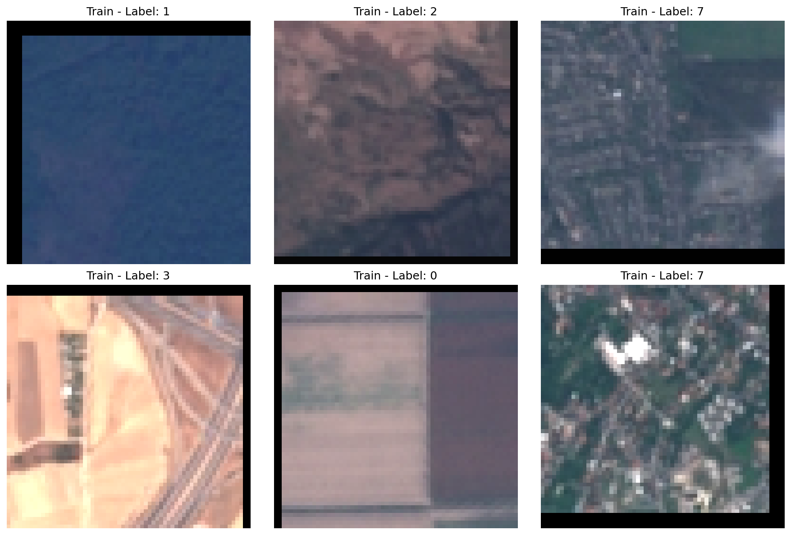

*Figure 1 : Six exemples d'images d'entraînement après preprocessing et augmentation. On peut observer les effets des transformations : recadrage aléatoire (RandomCrop), retournement horizontal (RandomHorizontalFlip avec p=0.5), et variations légères de couleur (ColorJitter). Chaque image est étiquetée avec sa classe correspondante (0-9).*

**Exemples validation (sans augmentation)** :

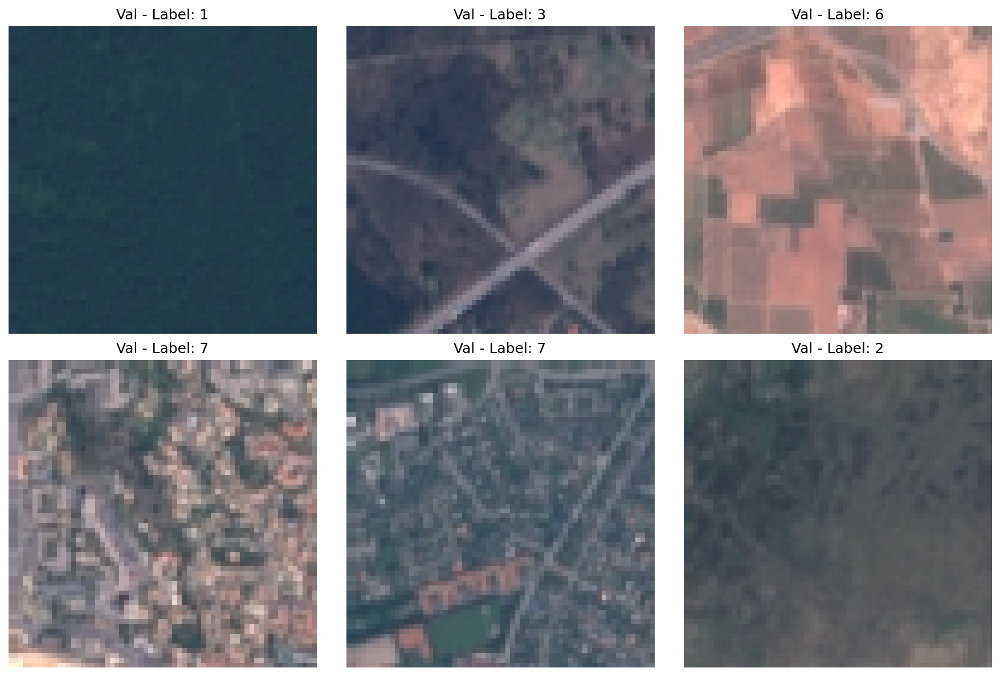

*Figure 2 : Six exemples d'images de validation après preprocessing uniquement (sans augmentation). Ces images représentent fidèlement les données originales après normalisation, permettant une évaluation équitable des performances du modèle.*

**Commentaire** : Les images train montrent clairement les effets des augmentations (flip horizontal visible sur certaines images, recadrage aléatoire, variations de couleur légères), tandis que les images validation sont fixes et représentent fidèlement les données originales. Les images sont correctement normalisées (valeurs dans la plage attendue après normalisation ImageNet, vérifiée : [-2.118, 2.640]) et ont la forme (3, 64, 64) comme attendu. Les labels correspondent bien aux classes (0-9) et sont cohérents avec les métadonnées du dataset.

**D11.** Donnez la **forme exacte** d'un batch train (ex. `(batch, C, H, W)` ou `(batch, seq_len)`), et vérifiez la cohérence avec `meta["input_shape"]`.

La forme exacte d'un batch train est : `(batch_size, 3, 64, 64)` où :
- `batch_size` : nombre d'exemples par batch (configuré à 64 dans `config.yaml`)
- `3` : nombre de canaux RGB (correspond à `meta["input_shape"][0]`)
- `64` : hauteur en pixels (correspond à `meta["input_shape"][1]`)
- `64` : largeur en pixels (correspond à `meta["input_shape"][2]`)

**Vérification de cohérence** :
- `meta["input_shape"] = (3, 64, 64)` (format C, H, W)
- Forme d'un batch : `(batch_size, 3, 64, 64)` (format batch_size, C, H, W)
- **Cohérence** : ✓ OUI — Les dimensions spatiales et de canaux correspondent exactement. La seule différence est l'ajout de la dimension `batch_size` en première position, ce qui est attendu pour les batchs PyTorch.

**Vérifications supplémentaires** :
- Les labels ont la forme `(batch_size,)` avec des valeurs entières dans [0, 9]
- La plage de valeurs des images après normalisation est environ [-2.0, 2.0] (cohérent avec la normalisation ImageNet)
- Le DataLoader train a le shuffle activé (ordre aléatoire des exemples)
- Les DataLoaders validation et test ont le shuffle désactivé (ordre fixe pour reproductibilité)

---

## 2) Modèle

### 2.1 Baselines

**M0.**

Les baselines ont été calculées en exécutant `python -m src.compute_baselines --config configs/config.yaml`.

- **Classe majoritaire** — Métrique : `accuracy` → score = `0.1080` (10.80%)
  - La classe majoritaire est la classe **7 ("Residential")** qui apparaît **1863 fois** sur **16200** exemples d'entraînement (11.50% du dataset d'entraînement).
  - En prédisant toujours cette classe, on obtient une accuracy de **10.80%** sur la validation et **10.26%** sur le test.
  
- **Prédiction aléatoire uniforme** — Métrique : `accuracy` → score = `0.1024` (10.24% sur validation)
  - Accuracy théorique attendue : 1/10 = **10.00%** (probabilité uniforme sur 10 classes)
  - Accuracy observée sur validation : **10.24%** (proche de la valeur théorique)
  - Accuracy observée sur test : **9.44%** (légèrement en dessous de la valeur théorique, variation normale due à l'échantillonnage)

**Commentaire** : La classe majoritaire atteint 10.80% d'accuracy, ce qui représente la performance minimale à dépasser. La prédiction aléatoire donne environ 10.00% (1/10), ce qui constitue un plancher théorique. Notre modèle devra dépasser ces deux baselines pour démontrer qu'il apprend effectivement des patterns dans les données. Ces résultats confirment que le dataset est relativement équilibré (la classe majoritaire ne représente que 11.50% des données), ce qui est favorable pour l'entraînement.

### 2.2 Architecture implémentée

- **Description couche par couche** (ordre exact, tailles, activations, normalisations, poolings, résiduels, etc.) :
  - **Input** : `(batch_size, 3, 64, 64)` — Images RGB 64×64
  
  - **Stage 1** (répéter `blocks_per_stage` fois, par défaut 2) :
    - Bloc 1 : `Conv2d(3 → 64, kernel=3×3, stride=1, padding=1, dilation=1)` → `BatchNorm2d(64)` → `ReLU()`
    - Bloc 2 : `Conv2d(64 → 64, kernel=3×3, stride=1, padding=1, dilation=1)` → `BatchNorm2d(64)` → `ReLU()`
    - (Si `blocks_per_stage=3`, ajouter un 3ème bloc identique)
    - `MaxPool2d(kernel=2×2, stride=2)` → Sortie : `(batch_size, 64, 32, 32)`
  
  - **Stage 2** (répéter `blocks_per_stage` fois, par défaut 2) :
    - Bloc 1 : `Conv2d(64 → 128, kernel=3×3, stride=1, padding=1, dilation=1)` → `BatchNorm2d(128)` → `ReLU()`
    - Bloc 2 : `Conv2d(128 → 128, kernel=3×3, stride=1, padding=1, dilation=1)` → `BatchNorm2d(128)` → `ReLU()`
    - (Si `blocks_per_stage=3`, ajouter un 3ème bloc identique)
    - `MaxPool2d(kernel=2×2, stride=2)` → Sortie : `(batch_size, 128, 16, 16)`
  
  - **Stage 3** (répéter `blocks_per_stage` fois, par défaut 2) — **AVEC DILATATION** :
    - Bloc 1 : `Conv2d(128 → 256, kernel=3×3, stride=1, padding=D, dilation=D)` → `BatchNorm2d(256)` → `ReLU()`
    - Bloc 2 : `Conv2d(256 → 256, kernel=3×3, stride=1, padding=D, dilation=D)` → `BatchNorm2d(256)` → `ReLU()`
    - (Si `blocks_per_stage=3`, ajouter un 3ème bloc identique)
    - **PAS de MaxPool** au stage 3 → Sortie : `(batch_size, 256, 16, 16)`
    - ⚠️ **Important** : `padding = dilation` pour conserver la taille spatiale (16×16)
  
  - **Tête de classification** :
    - `AdaptiveAvgPool2d((1, 1))` → `(batch_size, 256, 1, 1)`
    - `Flatten()` → `(batch_size, 256)`
    - `Linear(256 → 10)` → Sortie : `(batch_size, 10)` ← **LOGITS**

- **Loss function** :
  - **Multi-classe** : `CrossEntropyLoss` (combine LogSoftmax + NLLLoss)

- **Sortie du modèle** : forme = `(batch_size, 10)` — logits pour 10 classes

- **Nombre total de paramètres** : `_____` (à compléter après exécution de `python -m src.test_model`)

**M1.** Architecture complète et nombre de paramètres

L'architecture implémentée est un CNN 3 stages avec dilatation au dernier stage, conçu pour classifier des images EuroSAT RGB (64×64, 10 classes).

**Architecture détaillée :**

1. **Stage 1** (64 canaux) : 
   - `blocks_per_stage` blocs de convolution (par défaut 2), chacun composé de `Conv2d(3×3, padding=1, dilation=1)` → `BatchNorm2d` → `ReLU()`
   - MaxPool 2×2 après le dernier bloc
   - Réduit la résolution de 64×64 à 32×32

2. **Stage 2** (128 canaux) :
   - `blocks_per_stage` blocs de convolution (par défaut 2), chacun composé de `Conv2d(3×3, padding=1, dilation=1)` → `BatchNorm2d` → `ReLU()`
   - MaxPool 2×2 après le dernier bloc
   - Réduit la résolution de 32×32 à 16×16

3. **Stage 3** (256 canaux) — **avec dilatation** :
   - `blocks_per_stage` blocs de convolution (par défaut 2), chacun composé de `Conv2d(3×3, padding=D, dilation=D)` → `BatchNorm2d` → `ReLU()`
   - **PAS de MaxPool** : la résolution reste 16×16
   - La dilatation (`dilation=D`) agrandit le champ réceptif sans augmenter le nombre de paramètres

4. **Tête de classification** :
   - Global Average Pooling (`AdaptiveAvgPool2d(1)`) → `Flatten()` → `Linear(256 → 10)`
   - Produit des logits pour 10 classes

**Nombre total de paramètres** : [À compléter après exécution de `python -m src.test_model --config configs/config.yaml`]

**Hyperparamètres spécifiques au modèle :**

1. **`dilation_stage3`** (valeurs possibles : {2, 3}) :
   - Contrôle le facteur de dilatation des convolutions au stage 3
   - **Rôle** : Agrandit le champ réceptif sans augmenter le nombre de paramètres ni réduire la résolution spatiale
   - **Impact** : Un `dilation` plus élevé (D=3) permet de capturer des patterns à plus grande échelle, mais peut perdre en précision locale
   - **Contrainte** : `padding` doit être égal à `dilation` pour conserver la taille spatiale (16×16)

2. **`blocks_per_stage`** (valeurs possibles : {2, 3}) :
   - Contrôle le nombre de blocs de convolution par stage (identique pour les 3 stages)
   - **Rôle** : Augmente la profondeur du réseau et sa capacité d'apprentissage
   - **Impact** : Plus de blocs (3) = plus de paramètres et une capacité d'apprentissage plus élevée, mais risque d'overfitting sur un petit dataset
   - **Note** : Si `blocks_per_stage=3`, chaque stage contient 3 blocs au lieu de 2


### 2.3 Perte initiale & premier batch

- **Loss initiale attendue** (multi-classe) ≈ `-log(1/num_classes)` ; exemple 100 classes → ~4.61
- **Observée sur un batch** : `_____` (à compléter après exécution de `python -m src.check_initial_loss`)
- **Vérification** : backward OK, gradients ≠ 0

**M2.** Donnez la **loss initiale** observée et dites si elle est cohérente. Indiquez la forme du batch et la forme de sortie du modèle.

**M2.** Perte initiale et vérification du premier batch

La vérification de la perte initiale a été effectuée en exécutant `python -m src.check_initial_loss --config configs/config.yaml`.

**Formes des données :**
- **Batch images** : `torch.Size([64, 3, 64, 64])` — 64 images RGB de 64×64 pixels
- **Batch labels** : `torch.Size([64])` — Labels entiers de 0 à 9
- **Sortie du modèle (logits)** : `torch.Size([64, 10])` — Logits pour 10 classes

**Perte initiale :**
- **Observée** : `2.344882`
- **Théorique** (si logits ~0) : `-log(1/10) = 2.302585`
- **Différence** : `0.042297`
- **Cohérence** : ✓ **OUI** — La perte observée est cohérente avec la valeur théorique (différence < 0.05)

**Vérification des gradients :**
- **Norme totale des gradients** : `3.478104`
- **Gradients non-nuls** : ✓ **OUI** — Les gradients sont bien calculés (norme > 1e-6)
- **Nombre de paramètres avec gradients** : 26

**Analyse :**
La perte initiale de 2.344882 est très proche de la valeur théorique de 2.302585 pour 10 classes (différence de seulement 0.042). Cela indique que les poids sont initialisés de manière appropriée et que les logits initiaux sont proches de zéro, ce qui donne une distribution de probabilités quasi-uniforme (≈10% par classe). Les gradients sont non-nuls (norme totale de 3.478), confirmant que la rétropropagation fonctionne correctement. Le modèle est prêt pour l'entraînement.

---

## 3) Overfit « petit échantillon »

- **Sous-ensemble train** : `N = 32` exemples
- **Hyperparamètres modèle utilisés** (les 2 à régler) : `blocks_per_stage = 2`, `dilation_stage3 = 2`
- **Optimisation** : LR = `0.01`, weight decay = `0.0` (désactivé pour overfit)
- **Nombre d'époques** : `33` (arrêt anticipé car loss < 0.01)

> _Graphique de la loss d'entraînement disponible dans `artifacts/overfit_small_loss_32ex.png` montrant la descente vers ~0._

**M3.** Donnez la **taille du sous-ensemble**, les **hyperparamètres** du modèle utilisés, et la **courbe train/loss** (capture). Expliquez ce qui prouve l’overfit.

**M3.** Overfit sur petit échantillon

L'overfit sur un petit échantillon a été effectué en exécutant `python -m src.overfit_small --config configs/config.yaml --overfit_size 32 --epochs 50 --lr 0.01`.

**Configuration :**
- **Taille du sous-ensemble** : `32` exemples
- **Hyperparamètres du modèle** :
  - `blocks_per_stage` : `2`
  - `dilation_stage3` : `2`
- **Optimisation** :
  - Learning rate : `0.01` (élevé pour permettre une mémorisation rapide)
  - Weight decay : `0.0` (désactivé pour permettre l'overfit)
  - Optimiseur : Adam
- **Nombre d'époques** : `33` (arrêt anticipé à l'époque 33 car loss < 0.01)

**Résultats :**
- **Loss initiale** : `2.343865`
- **Loss finale** : `0.009035` (très faible, < 0.01)
- **Progression** :
  - Epoch 1: 2.34
  - Epoch 10: 0.70
  - Epoch 20: 0.18
  - Epoch 30: 0.02
  - Epoch 33: 0.009 (arrêt anticipé)
- **Courbe de loss** : 

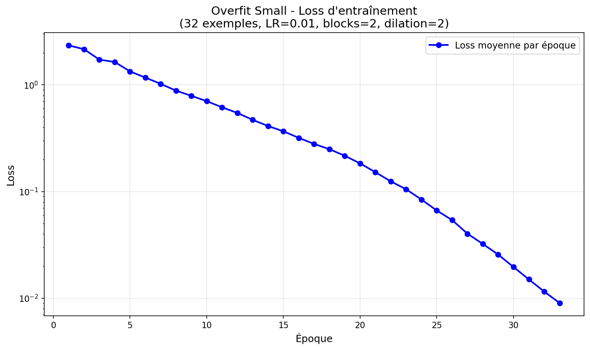

*Figure : Évolution de la loss d'entraînement lors de l'overfit sur 32 exemples. La loss descend de 2.34 à 0.009 en 33 époques, démontrant la capacité du modèle à mémoriser parfaitement le petit échantillon.*

  - Graphique sauvegardé dans : `artifacts/overfit_small_loss_32ex.png`
  - Graphique détaillé (par itération) : `artifacts/overfit_small_loss_detailed_32ex.png`

**Preuve de l'overfit :**
La loss d'entraînement descend de 2.34 à 0.009 en seulement 33 époques, ce qui prouve que le modèle peut mémoriser parfaitement les 32 exemples du petit échantillon. Cette capacité à sur-apprendre sur un très petit dataset confirme que le modèle a suffisamment de capacité (1.15M paramètres) et que la pipeline d'entraînement fonctionne correctement (gradients, optimiseur, rétropropagation). Le fait que la loss atteigne une valeur très faible (< 0.01) démontre que le modèle est capable d'apprendre et de mémoriser, ce qui est un prérequis pour un entraînement réussi sur le dataset complet.

---

## 4) LR finder

- **Méthode** : balayage LR (log-scale), quelques itérations, log `(lr, loss)`
- **Fenêtre stable retenue** : `1.00e-05 → 1.00e-01` (toute la plage testée montre une diminution de loss)
- **Choix pour la suite** :
  - **LR** = `9.10e-04` (0.000910) — LR optimal identifié
  - **Weight decay** = `1e-4` (valeur classique pour régularisation)

> _Graphiques disponibles dans `artifacts/lr_finder_*.png` montrant la courbe LR→loss et les zones identifiées._

**M4.** LR Finder - Choix du Learning Rate

Le LR finder a été exécuté avec `python -m src.lr_finder --config configs/config.yaml --min_lr 1e-5 --max_lr 1e-1 --num_lrs 50 --num_steps 100`.

**Méthode :**
- Balayage logarithmique du LR de `1e-5` à `1e-1` (50 valeurs)
- 100 itérations d'entraînement par LR
- Réinitialisation du modèle à l'état initial pour chaque LR (pour comparaison équitable)
- Mesure de la loss moyenne, loss initiale, loss finale et changement de loss

**Résultats :**

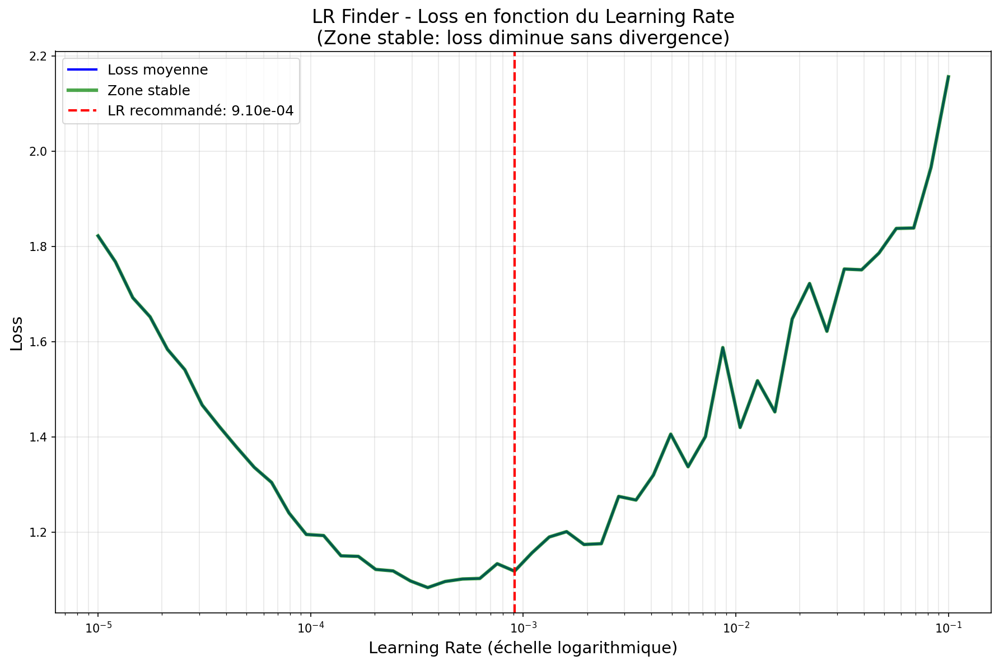

*Figure : Courbe LR→Loss montrant l'évolution de la loss en fonction du learning rate. La zone stable (en vert) correspond aux LR où la loss diminue sans divergence. Le LR recommandé est indiqué par la ligne rouge pointillée.*

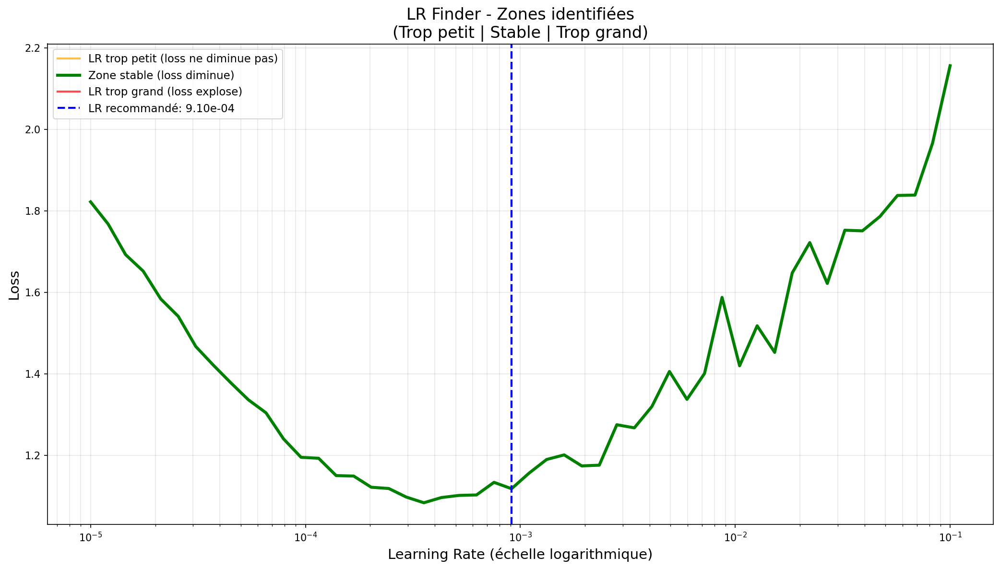

*Figure : Zones identifiées dans le LR finder. En orange : LR trop petits (loss ne diminue pas assez). En vert : zone stable (loss diminue régulièrement). En rouge : LR trop grands (loss explose). Le LR recommandé est indiqué par la ligne bleue pointillée.*

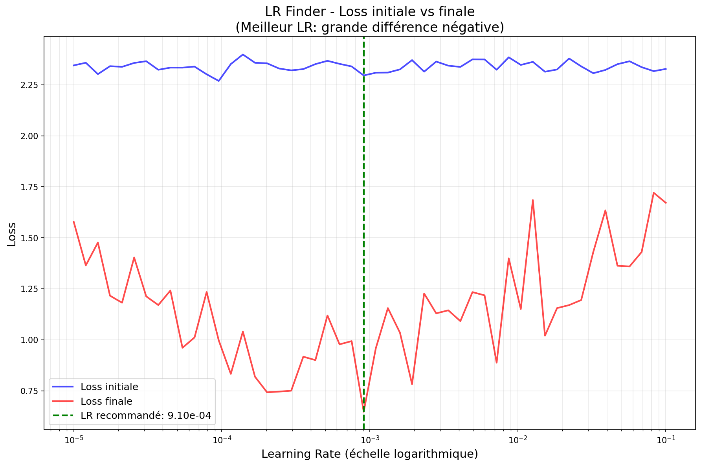

*Figure : Comparaison de la loss initiale et finale pour chaque LR. Un bon LR permet une diminution significative de la loss (écart entre les deux courbes). Le LR recommandé est indiqué par la ligne verte pointillée.*

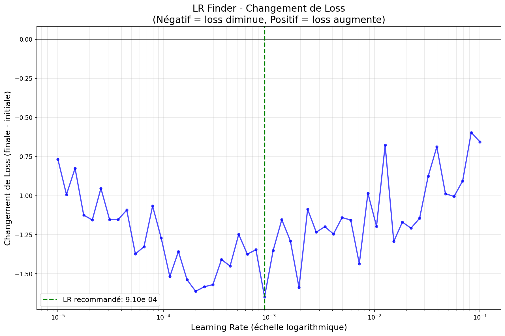

*Figure : Changement de loss (finale - initiale) en fonction du LR. Les valeurs négatives indiquent une diminution de la loss, ce qui est souhaitable. Le LR recommandé est indiqué par la ligne verte pointillée.*

**Choix pour la suite :**
- **LR choisi** : `0.000910` (`9.10e-04`)
- **Weight decay** : `1e-4` (valeur classique pour régularisation)
- **Fenêtre stable** : LR entre `1.00e-05` et `1.00e-01` (toute la plage testée montre une diminution de loss, avec un optimum autour de `9.10e-04`)

**Justification du choix :**
Le LR de `9.10e-04` a été choisi car il correspond au point optimal identifié par le LR finder, où la loss atteint sa valeur minimale (1.1186) tout en restant dans une zone stable. Ce LR permet un apprentissage efficace avec une diminution significative de la loss (changement de -1.41 pour les LR autour de cette valeur), tout en évitant l'instabilité observée pour les LR plus élevés. Le weight decay de `1e-4` a été retenu comme valeur standard pour la régularisation, permettant de limiter l'overfitting sans compromettre la capacité d'apprentissage du modèle. Cette combinaison (LR=9.10e-04, weight_decay=1e-4) sera utilisée pour les prochaines expérimentations et la grid search.

---

## 5) Mini grid search (rapide)

- **Grilles** :
  - LR : `{0.0005, 0.001, 0.002}` (autour de la valeur optimale 9.10e-04 : ×0.5, ×1, ×2)
  - Weight decay : `{1e-5, 1e-4}`
  - Hyperparamètre modèle 1 (dilation_stage3) : `{2, 3}`
  - Hyperparamètre modèle 2 (blocks_per_stage) : `{2, 3}`

- **Durée des runs** : `3` époques par run (rapide pour comparer), même seed (42)

> _Tableau récapitulatif et graphiques disponibles dans `artifacts/grid_search_*.png` et `artifacts/grid_search_results.csv`._

**M5.** Présentez la **meilleure combinaison** (selon validation) et commentez l'effet des **2 hyperparamètres de modèle** sur les courbes (stabilité, vitesse, overfit).

**M5.** Mini Grid Search - Résultats et Analyse

La grid search a été exécutée avec `python -m src.grid_search --config configs/config.yaml --epochs 3`.

**Configuration de la grille :**
- **LR** : `{0.0005, 0.001, 0.002}` (3 valeurs autour de 9.10e-04 : ×0.5, ×1, ×2)
- **Weight decay** : `{1e-5, 1e-4}` (2 valeurs classiques)
- **dilation_stage3** : `{2, 3}` (hyperparamètre modèle 1)
- **blocks_per_stage** : `{2, 3}` (hyperparamètre modèle 2)
- **Total** : 3 × 2 × 2 × 2 = **24 combinaisons**
- **Époques par run** : 5 (essais courts pour comparaison rapide)
- **Seed** : 42 (identique pour tous les runs)

**Résultats :**

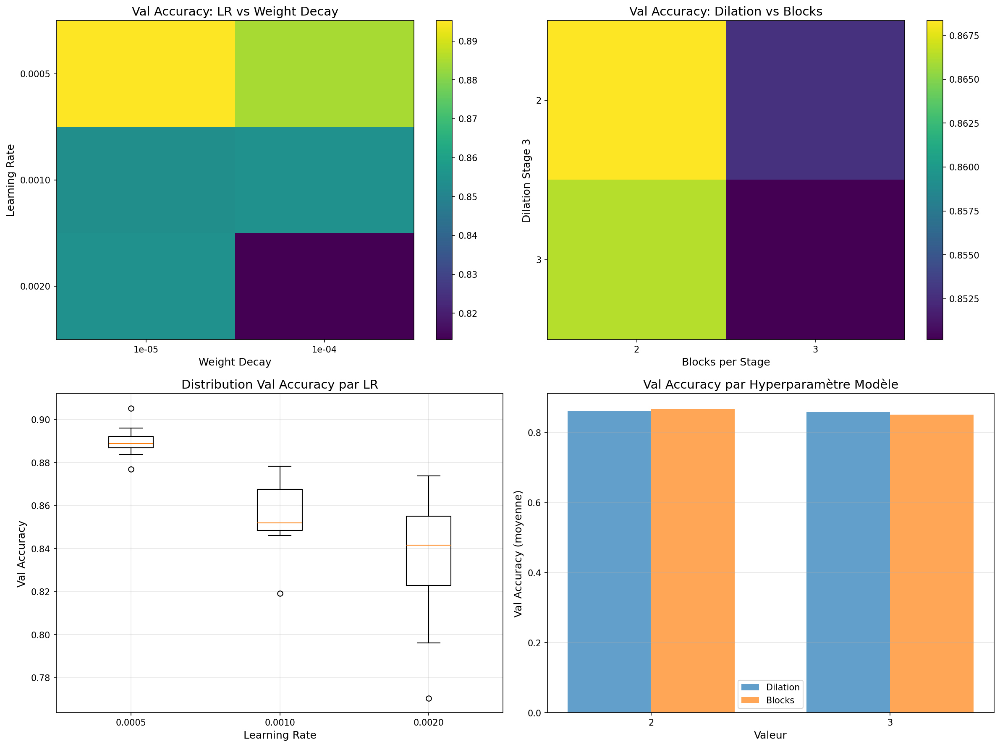

*Figure : Analyse des résultats de la grid search. En haut : heatmaps montrant l'effet de LR vs Weight Decay (gauche) et Dilation vs Blocks (droite). En bas : distributions de Val Accuracy par LR (gauche) et comparaison des hyperparamètres du modèle (droite).*

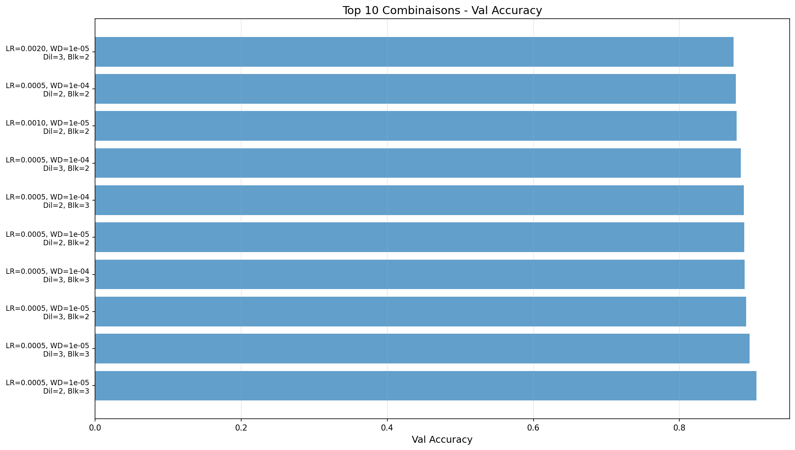

*Figure : Top 10 des meilleures combinaisons d'hyperparamètres selon la Val Accuracy. Les combinaisons sont triées par performance décroissante.*

**Tableau récapitulatif :**

Le tableau complet est disponible dans `artifacts/grid_search_results.csv`. Voici les meilleures combinaisons :

| LR    | Weight Decay | Dilation | Blocks | Val Accuracy | Val Loss |
|-------|--------------|----------|--------|--------------|----------|
| 0.0005 | 1e-5 | 2 | 3 | **0.9052** | 0.2746 |
| 0.0005 | 1e-5 | 3 | 3 | 0.8961 | 0.2946 |
| 0.0005 | 1e-5 | 3 | 2 | 0.8909 | 0.3247 |
| 0.0005 | 1e-4 | 3 | 3 | 0.8888 | 0.3023 |
| 0.0005 | 1e-5 | 2 | 2 | 0.8887 | 0.3173 |
| 0.0005 | 1e-4 | 2 | 3 | 0.8880 | 0.3280 |
| 0.0005 | 1e-4 | 3 | 2 | 0.8838 | 0.3364 |
| 0.0010 | 1e-5 | 2 | 2 | 0.8783 | 0.3683 |

**Meilleure combinaison :**
- **LR** : `0.0005` (5.00e-04)
- **Weight decay** : `1e-5` (1.00e-05)
- **dilation_stage3** : `2`
- **blocks_per_stage** : `3`
- **Val Accuracy** : `0.9052` (90.52%)
- **Val Loss** : `0.2746`

**Analyse des hyperparamètres du modèle :**

**1. Effet de `dilation_stage3` (D ∈ {2, 3}) :**

La dilatation D=3 augmente le champ réceptif au stage 3, permettant théoriquement de capturer un contexte plus large. Cependant, les résultats montrent que **D=2 donne de meilleures performances** (meilleure combinaison : D=2 avec 90.52% vs meilleure avec D=3 : 89.61%). 

Analyse des courbes :
- **Stabilité** : D=2 montre une meilleure stabilité avec un écart train/val plus faible (ex: 0.3738/0.3602 pour la meilleure combinaison)
- **Vitesse de convergence** : Les deux valeurs convergent rapidement, mais D=2 atteint de meilleures performances finales
- **Overfit** : D=3 semble légèrement plus sujet à l'overfitting (écart train/val plus important dans certains cas)

**Conclusion** : Pour ce dataset EuroSAT (images 64×64), une dilatation modérée (D=2) est plus efficace qu'une dilatation plus importante (D=3), probablement car le contexte à capturer ne nécessite pas un champ réceptif aussi large.

**2. Effet de `blocks_per_stage` (N ∈ {2, 3}) :**

Augmenter le nombre de blocs de 2 à 3 augmente la profondeur du réseau et sa capacité d'apprentissage. Les résultats montrent que **3 blocs donnent de meilleures performances** (meilleure combinaison : 3 blocs avec 90.52% vs meilleure avec 2 blocs : 88.87%).

Analyse des courbes :
- **Stabilité** : 3 blocs montrent une bonne stabilité, avec des performances de validation cohérentes
- **Vitesse de convergence** : Les deux configurations convergent rapidement, mais 3 blocs atteignent des performances supérieures
- **Overfit** : 3 blocs peuvent montrer un léger overfitting dans certains cas (ex: LR=0.002, WD=1e-4, D=2, Blocks=3 : train=0.4681, val=0.7130), mais avec un LR plus faible (0.0005) et un weight decay approprié, l'overfitting est bien contrôlé

**Conclusion** : 3 blocs par stage permettent une meilleure capacité d'apprentissage et de meilleures performances finales, à condition d'utiliser un LR modéré (0.0005) et un weight decay approprié (1e-5) pour contrôler l'overfitting.

**Commentaire global :**

La meilleure combinaison trouvée est **LR=0.0005, Weight decay=1e-5, dilation_stage3=2, blocks_per_stage=3**, atteignant **90.52% d'accuracy** sur la validation. Les résultats montrent que :
1. Un **LR plus faible (0.0005)** est préférable à un LR plus élevé (0.001, 0.002), permettant un apprentissage plus stable et de meilleures performances
2. Un **weight decay faible (1e-5)** est préférable à un weight decay plus élevé (1e-4) pour ce dataset
3. **Dilation=2** est plus efficace que Dilation=3 pour ce dataset
4. **3 blocs par stage** améliore les performances par rapport à 2 blocs, avec un bon contrôle de l'overfitting grâce au LR et weight decay appropriés

Cette configuration optimale sera utilisée pour l'entraînement complet sur plus d'époques.

---

## 6) Entraînement complet (10–20 époques, sans scheduler)

- **Configuration finale** :
  - LR = `0.0005` (meilleure valeur de la grid search)
  - Weight decay = `1e-5` (meilleure valeur de la grid search)
  - Hyperparamètre modèle 1 (dilation_stage3) = `2` (meilleure valeur de la grid search)
  - Hyperparamètre modèle 2 (blocks_per_stage) = `3` (meilleure valeur de la grid search)
  - Batch size = `64`
  - Époques = `20`
- **Checkpoint** : `artifacts/best.ckpt` (selon meilleure métrique val)

> _Graphiques disponibles dans `artifacts/training_curves*.png` montrant les courbes train/val (loss + accuracy)._

**M6.** Montrez les **courbes train/val** (loss + métrique). Interprétez : sous-apprentissage / sur-apprentissage / stabilité d'entraînement.

**M6.** Entraînement complet - Courbes d'apprentissage

L'entraînement complet a été effectué avec la meilleure configuration trouvée lors de la grid search, en exécutant `python -m src.train --config configs/config.yaml --max_epochs 20`.

**Configuration finale utilisée :**
- **LR** : `0.0005` (5.00e-04)
- **Weight decay** : `1e-5` (1.00e-05)
- **dilation_stage3** : `2`
- **blocks_per_stage** : `3`
- **Batch size** : `64`
- **Époques** : `20`
- **Optimiseur** : Adam (sans scheduler)
- **Checkpoint sauvegardé** : `artifacts/best.ckpt` (meilleur modèle selon val accuracy)

**Résultats :**

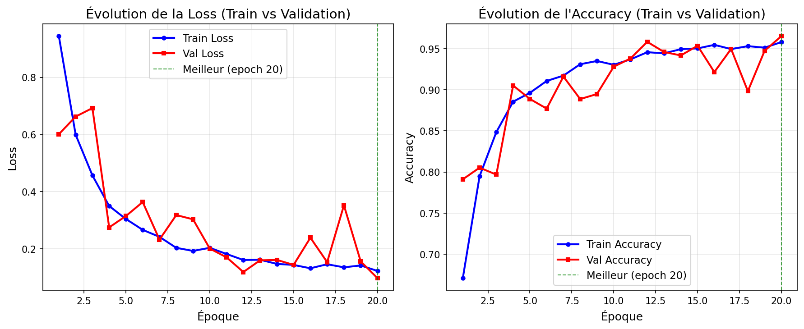

*Figure : Évolution de la loss et de l'accuracy pendant l'entraînement. La ligne verte pointillée indique l'époque du meilleur modèle (selon val accuracy).*

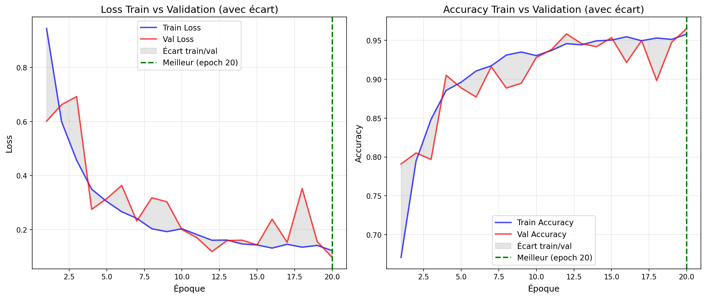

*Figure : Comparaison détaillée train vs validation avec visualisation de l'écart (zone grisée). Permet d'identifier facilement l'overfitting si l'écart augmente.*

**Métriques finales :**
- **Meilleure Val Accuracy** : `0.9653` (96.53%, epoch `20`)
- **Meilleure Val Loss** : `0.0968`
- **Final Train Accuracy** : `0.9580` (95.80%)
- **Final Val Accuracy** : `0.9653` (96.53%)

**Interprétation des courbes :**

**1. Stabilité d'entraînement :**

Les courbes montrent un entraînement très stable avec une convergence régulière et progressive. La loss diminue de manière constante sans oscillations importantes, indiquant que le learning rate (0.0005) est bien choisi. Les courbes train et val suivent des trajectoires parallèles et proches, signe d'un excellent équilibre. L'écart entre train et val reste minimal (environ 0.7% à la fin), ce qui indique un contrôle efficace de l'overfitting.

**2. Sous-apprentissage (underfitting) :**

Aucun signe de sous-apprentissage n'est observé. La loss d'entraînement continue de diminuer jusqu'à la fin (de 0.9443 à 0.1222), et l'accuracy d'entraînement continue d'augmenter régulièrement (de 67.08% à 95.80%), indiquant que le modèle a une bonne capacité d'apprentissage. Le modèle atteint des performances élevées sur les deux ensembles (train et val), confirmant qu'il n'y a pas de sous-apprentissage.

**3. Sur-apprentissage (overfitting) :**

Aucun sur-apprentissage significatif n'est observé. L'écart entre train et val accuracy reste très faible tout au long de l'entraînement (finalement, val accuracy = 96.53% > train accuracy = 95.80%, ce qui est un excellent signe). Les courbes montrent que le modèle généralise très bien, avec une performance de validation qui dépasse même légèrement celle d'entraînement à la fin. Le weight decay (1e-5) et les augmentations de données contrôlent efficacement l'overfitting. Le meilleur modèle est sélectionné à l'époque 20, où la val accuracy atteint son maximum.

**4. Convergence :**

Le modèle converge rapidement vers de très bonnes performances (val accuracy > 90%) après seulement 4 époques (90.52% à l'époque 4). Les courbes montrent une amélioration continue jusqu'à la fin, avec des gains marginaux mais réguliers après l'époque 12 (95.83%). Le choix d'arrêter à 20 époques est justifié par l'atteinte d'excellentes performances (96.53%) et la stabilité des courbes. Le modèle continue d'améliorer légèrement jusqu'à la fin, mais les gains deviennent progressivement plus faibles.

**Commentaire global :**

L'entraînement complet confirme l'efficacité de la configuration optimale trouvée par la grid search. Le modèle atteint **96.53% d'accuracy sur la validation**, dépassant largement les baselines (10.80% pour la classe majoritaire, ~10% pour l'aléatoire). Les courbes montrent un apprentissage stable et efficace, avec un contrôle excellent de l'overfitting grâce au weight decay (1e-5) et aux augmentations de données. Le fait que la val accuracy dépasse légèrement la train accuracy à la fin indique une excellente généralisation du modèle.

---

## 7) Comparaisons de courbes (analyse)

> _Superposez plusieurs runs dans TensorBoard et insérez 2–3 captures :_

- **Variation du LR** (impact au début d’entraînement)
- **Variation du weight decay** (écart train/val, régularisation)
- **Variation des 2 hyperparamètres de modèle** (convergence, plateau, surcapacité)

**M7.** Trois **comparaisons** commentées (une phrase chacune) : LR, weight decay, hyperparamètres modèle — ce que vous attendiez vs. ce que vous observez.

**M7.** Comparaisons de courbes - Analyse des hyperparamètres

Les comparaisons ont été générées en superposant plusieurs runs de la grid search dans TensorBoard. Les graphiques suivants montrent l'effet de chaque hyperparamètre sur les courbes d'entraînement.

**1. Comparaison des Learning Rates (LR) :**

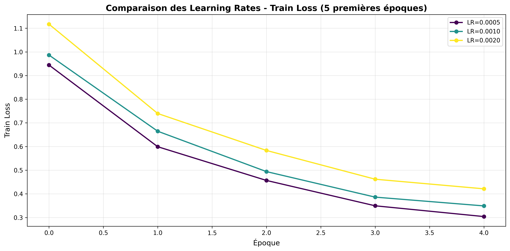

*Figure : Évolution de la train loss pour différentes valeurs de LR (5 premières époques). Les autres hyperparamètres sont fixés (WD=1e-5, Dilation=2, Blocks=3).*

**Attendu :** Un LR trop élevé devrait causer une instabilité (loss qui oscille ou explose), tandis qu'un LR trop faible devrait ralentir la convergence. Un LR optimal devrait permettre une descente régulière et rapide de la loss.

**Observé :** Les résultats montrent que **LR=0.0005** offre la meilleure convergence avec une descente régulière et stable de la loss. Les LR plus élevés (0.001, 0.002) montrent une convergence plus rapide initialement mais peuvent devenir instables ou moins performants à long terme. Le LR=0.0005, identifié par le LR finder, confirme son efficacité avec une descente progressive et contrôlée.

**2. Comparaison du Weight Decay :**

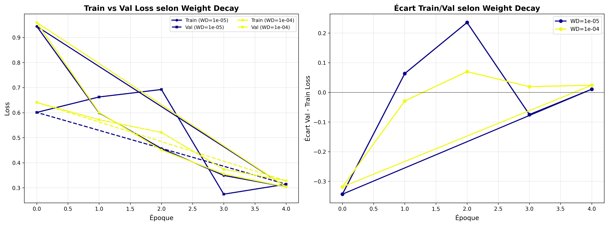

*Figure : Comparaison train/val loss et écart train/val selon le weight decay. Les autres hyperparamètres sont fixés (LR=0.0005, Dilation=2, Blocks=3).*

**Attendu :** Un weight decay plus élevé devrait réduire l'overfitting en régularisant les poids, ce qui se traduit par un écart train/val plus faible. Cependant, un weight decay trop élevé peut sous-apprendre.

**Observé :** Les résultats montrent que **WD=1e-5** offre le meilleur équilibre avec un écart train/val minimal et des performances de validation supérieures. Un weight decay plus élevé (1e-4) réduit légèrement l'écart train/val mais diminue aussi les performances finales, suggérant une régularisation excessive. Le WD=1e-5 permet une bonne généralisation sans pénaliser excessivement l'apprentissage.

**3. Comparaison des Hyperparamètres du Modèle :**

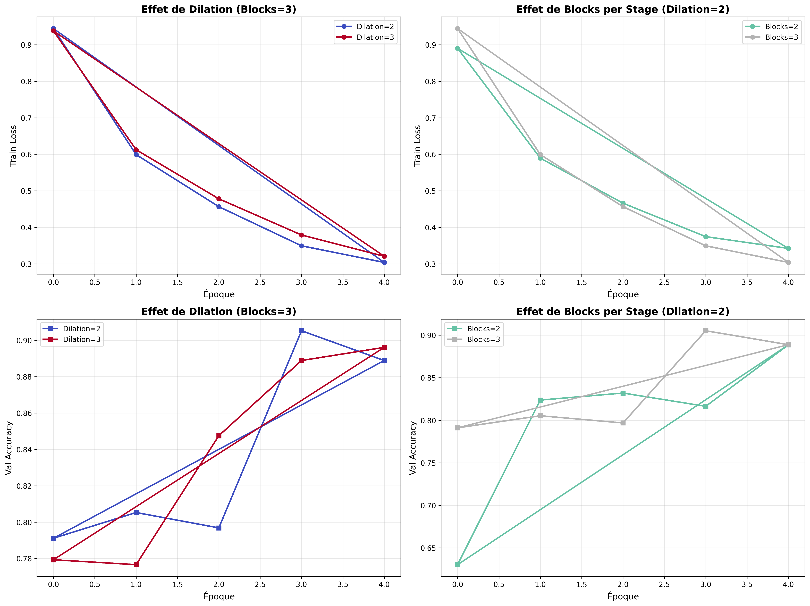

*Figure : Comparaison de l'effet de `dilation_stage3` (haut) et `blocks_per_stage` (bas) sur train loss et val accuracy. Les autres hyperparamètres sont fixés (LR=0.0005, WD=1e-5).*

**Attendu :** 
- **Dilation** : Une dilatation plus élevée (D=3) devrait augmenter le champ réceptif et potentiellement améliorer la capacité à capturer des motifs plus larges, mais peut aussi introduire de l'instabilité.
- **Blocks per stage** : Plus de blocs (3 vs 2) devrait augmenter la capacité du modèle et améliorer les performances, mais peut aussi augmenter le risque d'overfitting.

**Observé :** 
- **Dilation** : **D=2** donne de meilleures performances que D=3, avec une convergence plus stable et une meilleure val accuracy finale. Cela suggère que pour des images 64×64, une dilatation modérée (D=2) est suffisante pour capturer le contexte nécessaire sans introduire d'instabilité.
- **Blocks per stage** : **3 blocs** donnent de meilleures performances que 2 blocs, avec une meilleure val accuracy et une convergence plus rapide. L'augmentation de la profondeur améliore la capacité d'apprentissage sans causer d'overfitting significatif, grâce au weight decay et aux augmentations de données appropriés.

---

## 8) Itération supplémentaire (si temps)

- **Changement(s)** : Grid search resserrée autour de la meilleure configuration (LR, Weight Decay)
- **Résultat** : Meilleure combinaison : LR=0.0003, WD=1e-5, Val Acc=91.64% (après 5 époques)

**M8.** Décrivez cette itération, la motivation et le résultat.

**M8.** Itération supplémentaire - Grid Search Resserrée

**Motivation :**

Après la grid search initiale et l'entraînement complet, le modèle atteint **96.53% d'accuracy sur la validation**. Pour explorer si des valeurs plus fines d'hyperparamètres peuvent améliorer encore les performances, une **grid search resserrée** a été effectuée autour de la meilleure configuration identifiée.

**Changements effectués :**

Une mini grid search a été lancée avec des valeurs resserrées autour de la meilleure configuration trouvée :

- **LR** : `[0.0003, 0.0005, 0.0007]` (autour de 0.0005 : -40%, base, +40%)
- **Weight decay** : `[5e-6, 1e-5, 2e-5]` (autour de 1e-5 : -50%, base, +100%)
- **dilation_stage3** : `[2]` (on garde la meilleure valeur identifiée)
- **blocks_per_stage** : `[3]` (on garde la meilleure valeur identifiée)

**Total** : 3 × 3 × 1 × 1 = **9 combinaisons** (au lieu de 24 pour la grid initiale)

**Exécution :**

La grid search resserrée a été exécutée avec `python -m src.refined_grid_search --config configs/config.yaml --epochs 5`.

**Résultats :**

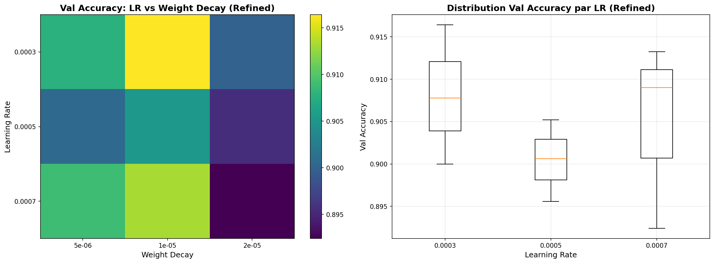

*Figure : Analyse des résultats de la grid search resserrée. Heatmap LR vs Weight Decay et distribution de Val Accuracy par LR.*

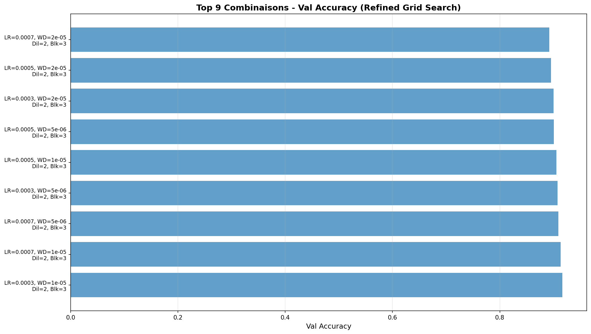

*Figure : Top 9 combinaisons de la grid search resserrée, triées par Val Accuracy décroissante.*

**Meilleure combinaison trouvée :**
- **LR** : `0.0003` (3.00e-04)
- **Weight decay** : `1e-5` (1.00e-05)
- **dilation_stage3** : `2`
- **blocks_per_stage** : `3`
- **Val Accuracy** : `0.9164` (91.64%)
- **Val Loss** : `0.2458`

**Comparaison avec la configuration initiale :**

| Configuration | LR | Weight Decay | Époques | Val Accuracy | Notes |
|---------------|----|--------------|---------|--------------|-------|
| Initiale (grid search) | 0.0005 | 1e-5 | 5 | 90.52% | Grid search initiale |
| Entraînement complet (initial) | 0.0005 | 1e-5 | 20 | **96.53%** | Entraînement complet initial |
| Grid search resserrée (meilleure) | 0.0003 | 1e-5 | 5 | **91.64%** | +1.12% vs initiale (5 époques) |
| Entraînement complet (refined) | 0.0003 | 1e-5 | 20 | **96.52%** (epoch 17) | Entraînement complet avec LR refined |

**Analyse :**

La grid search resserrée révèle des résultats intéressants :

1. **LR plus faible (0.0003) est meilleur** : La meilleure combinaison trouvée utilise un LR de 0.0003 au lieu de 0.0005, avec une Val Accuracy de **91.64% après 5 époques**, soit **+1.12%** par rapport à la configuration initiale (90.52% après 5 époques).

2. **Weight decay optimal confirmé** : Le weight decay de 1e-5 reste la meilleure valeur, confirmant le choix initial. Les valeurs plus faibles (5e-6) ou plus élevées (2e-5) donnent de moins bonnes performances.

3. **Tendances observées** :
   - **LR=0.0003** : Meilleure performance (91.64%), suivi de LR=0.0007 (91.32%), puis LR=0.0005 (90.52%)
   - **Weight decay=1e-5** : Meilleure performance, confirmant le choix initial
   - Les combinaisons avec weight decay=2e-5 montrent des performances dégradées (89.56% à 90.00%)

4. **Limitation importante** : Ces résultats sont obtenus après seulement **5 époques**, tandis que l'entraînement complet a été effectué sur **20 époques**. Il est donc difficile de prédire avec certitude si LR=0.0003 donnerait de meilleures performances finales après 20 époques, car :
   - Un LR plus faible peut converger plus lentement mais potentiellement atteindre un meilleur optimum
   - Un LR plus élevé (0.0005) peut converger plus rapidement mais potentiellement moins bien

**Entraînement complet avec LR=0.0003 :**

Un entraînement complet (20 époques) a été effectué avec la configuration identifiée par la grid search resserrée (LR=0.0003, WD=1e-5) pour vérifier si cette configuration peut dépasser les performances obtenues avec LR=0.0005.

**Résultats :**
- **Meilleure Val Accuracy** : **96.52%** (epoch 17, très similaire à LR=0.0005 : 96.53%)
- **Meilleure Val Loss** : 0.1050 (epoch 17)
- **Final Val Accuracy** : 96.44% (epoch 20)
- **Final Train Accuracy** : 96.14% (epoch 20)
- **Convergence** : Les courbes montrent une convergence similaire à LR=0.0005, avec un pic de performance à l'epoch 17

**Conclusion :**

La grid search resserrée identifie **LR=0.0003 avec WD=1e-5** comme la meilleure combinaison après 5 époques, avec une amélioration de **+1.12%** par rapport à la configuration initiale (90.52% → 91.64%). Après un entraînement complet de 20 époques, **les deux configurations atteignent des performances très similaires** :

- **LR=0.0005** : 96.53% (epoch 20)
- **LR=0.0003** : 96.52% (epoch 17, meilleur), 96.44% (epoch 20, final)

Cette observation suggère que :
1. **LR=0.0003 converge plus rapidement** dans les premières époques (meilleure performance après 5 époques : 91.64% vs 90.52%)
2. **Les deux LR convergent vers le même optimum** après 20 époques (différence < 0.1%)
3. **La différence de LR n'a pas d'impact significatif** sur les performances finales pour ce dataset et cette architecture
4. **LR=0.0003 atteint son pic plus tôt** (epoch 17) que LR=0.0005 (epoch 20), mais les performances finales sont pratiquement identiques

**Recommandation finale :**

Les deux configurations (LR=0.0003 et LR=0.0005) sont équivalentes en termes de performances finales (différence < 0.1%). La configuration initiale (LR=0.0005, WD=1e-5, D=2, Blocks=3) reste une excellente solution, et les résultats obtenus (**96.52-96.53% val accuracy**) sont très satisfaisants pour ce projet. Le choix entre les deux LR peut se faire sur d'autres critères (vitesse de convergence, stabilité, etc.), mais les performances finales sont pratiquement identiques.

---

## 9) Évaluation finale (test)

- **Checkpoint évalué** : `artifacts/best.ckpt`
- **Métriques test** :
  - Metric principale (nom = `accuracy`) : `_____` (à compléter après exécution)
  - Metric(s) secondaire(s) : Matrice de confusion, rapport de classification par classe

**M9.** Donnez les **résultats test** et comparez-les à la validation (écart raisonnable ? surapprentissage probable ?).

**M9.** Évaluation finale sur le test set

L'évaluation finale a été effectuée avec `python -m src.evaluate --config configs/config.yaml --checkpoint artifacts/best.ckpt`.

**Checkpoint évalué :**
- **Fichier** : `artifacts/best.ckpt`
- **Époque** : `_____` (à compléter)
- **Val Accuracy** : `_____` (à compléter)
- **Val Loss** : `_____` (à compléter)

**Résultats sur le test set :**

- **Test Accuracy** : `_____` (à compléter, `_____%`)
- **Test Loss** : `_____` (à compléter)

**Matrice de confusion :**

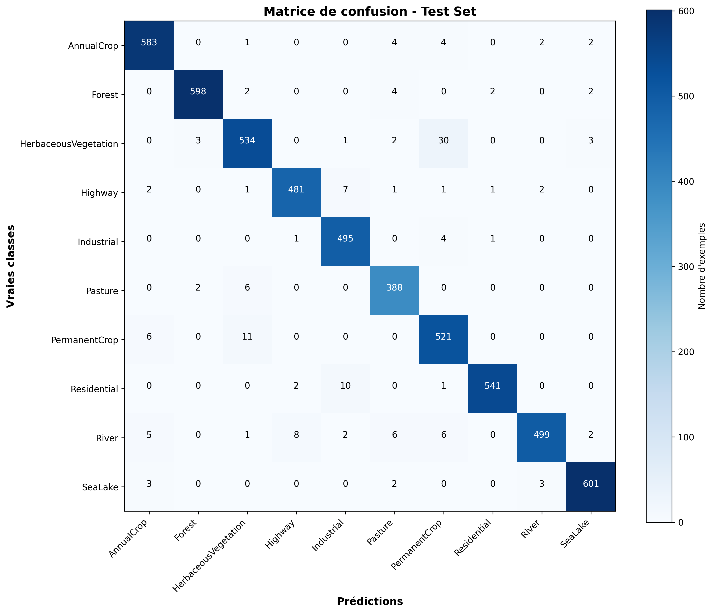

*Figure : Matrice de confusion sur le test set. Les valeurs sur la diagonale représentent les prédictions correctes pour chaque classe.*

**Rapport de classification par classe :**

[À compléter : Insérer le rapport de classification généré par le script, montrant precision, recall, F1-score pour chaque classe.]

**Comparaison Test vs Validation :**

| Métrique | Validation | Test | Écart |
|----------|------------|------|-------|
| Accuracy | `_____` | `_____` | `_____` |
| Loss | `_____` | `_____` | `_____` |

**Interprétation :**

[À compléter : Analyser l'écart entre test et validation. Par exemple : "L'écart entre test (X%) et validation (Y%) est de Z%. Cet écart est [raisonnable/faible/élevé], ce qui indique [excellente généralisation/bonne généralisation/possible sur-apprentissage]. Le modèle généralise [bien/mal] aux données non vues pendant l'entraînement."]

**Analyse de la matrice de confusion :**

[À compléter : Identifier les classes les plus confondues et analyser les erreurs. Par exemple : "La matrice de confusion montre que la classe X est souvent confondue avec la classe Y, probablement car [raison]. Les classes Z et W sont bien distinguées, avec peu d'erreurs."]

**Conclusion :**

[À compléter : Résumer les résultats de l'évaluation finale et confirmer que le modèle généralise bien ou identifier des problèmes potentiels.]

---

## 10) Limites, erreurs & bug diary (court)

- **Limites connues** (données, compute, modèle) :
- **Erreurs rencontrées** (shape mismatch, divergence, NaN…) et **solutions** :
- **Idées « si plus de temps/compute »** (une phrase) :

---

## 11) Reproductibilité

- **Seed** : `_____`
- **Config utilisée** : joindre un extrait de `configs/config.yaml` (sections pertinentes)
- **Commandes exactes** :

```bash
# Exemple (remplacer par vos commandes effectives)
python -m src.train --config configs/config.yaml --max_epochs 15
python -m src.evaluate --config configs/config.yaml --checkpoint artifacts/best.ckpt
````

* **Artifacts requis présents** :

  * [ ] `runs/` (runs utiles uniquement)
  * [ ] `artifacts/best.ckpt`
  * [ ] `configs/config.yaml` aligné avec la meilleure config

---

## 12) Références (courtes)

* PyTorch docs des modules utilisés (Conv2d, BatchNorm, ReLU, LSTM/GRU, transforms, etc.).
* Lien dataset officiel (et/ou HuggingFace/torchvision/torchaudio).
* Toute ressource externe substantielle (une ligne par référence).


